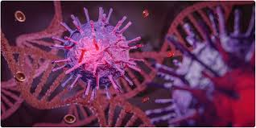

```{r setup, include=FALSE}
knitr::opts_chunk$set(message=FALSE,warning=FALSE, cache=TRUE)
```

# CÓMO INDENTIFICAR Y CARACTERIZAR UN GEN A PARTIR DE SU SECUENCIA DE ADN
* Copiar la secuencia dada para introducirla en el programa BLAST
* Entrar en la opción que dice Nucleotide Blast 
* Pegar la secuencia de ADN en donde indica “Enter Query Sequence”
* Apretar el boton que dice BLAST y esperar unos minutos por el resultado (una lista)
* Clickear sobre la primera secuencia de ADN que figura en la lista obtenida 
* Entrar al link, que es un número azul, que corresponde a la secuencia clickeada en el paso anterior
* Copiar el número de locus, insertarlo en el programa Uniprot y apretar “Search”
* Clickear sobre la primera entrada que aparece e investigar 
* Entrar al link del programa llamado KEGG Pathway
* Seleccionar el organismo donde dice “Organism”
* Donde dice “Enter keywords” ingresar el nombre de la enzima con el número EC que se saca de Uniprot 
* De los mapas metabólicos que aparecen, seleccionar el más relevante de acuerdo a lo que se quiere conocer de este gen (entrar a la vía metabólica)
Una vez encontrada la vía metabólica, que corresponde a la proteína, explorarla


# Cómo encontrar secuencias de ADN de genes de interés

* Ingresar a la plataforma NCBI y entrar al sitio llamado Gene
* Tipear el nombre del gen en la parte superior y clickear en “search”
* Seleccionar también una especie para acotar la búsqueda
* De la lista de proteínas que devuelve, elegir una e iniciar la exploración
* Entrar a los enlaces a la secuencia del ARNm y a la proteína
* Entrar a Uniprot con el locus correspondiente a esta proteína 
* Chequear si en la ubicación subcelular se encuentra la explicación de para qué sirve el péptido señal 
* Repetir el ejercicio con la quitinasa de tomate 
* Buscar que representan las estructuras de exones e intrones y como se procesan durante la maduración del ARNm


# Step 2


# Step 3


# Step 4


# Step 5

