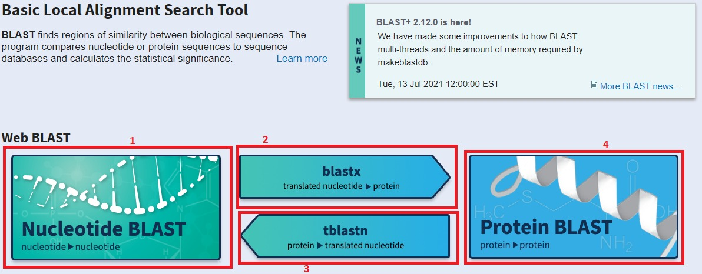

```{r setup, include=FALSE}
knitr::opts_chunk$set(message=FALSE,warning=FALSE, cache=TRUE)
```

# CÓMO INDENTIFICAR Y CARACTERIZAR UN GEN A PARTIR DE SU SECUENCIA DE ADN
* Copiar la secuencia dada para introducirla en el programa BLAST
*
*
*


Notice that whatever you define as a top level header, automatically gets put into the table of contents bar on the left. 

### Bifurcacion 1

You can add more headers by adding more hashtags. These won't be put into the table of contents

### Bifurcacion 2


# Step 2


# Step 3


# Step 4


# Step 5

